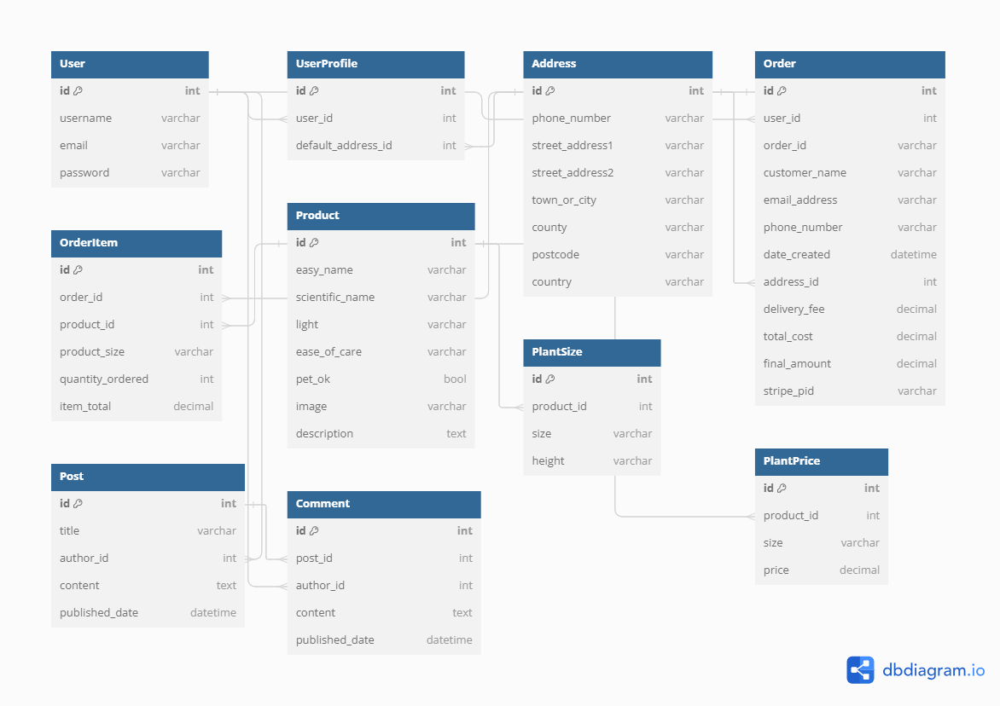

# Botanica Houseplants
Find the deployed project [here](https://botanica-fa2bcebcf990.herokuapp.com/)!

## Introduction
Botanica is your go to online destination for the most vibrant houseplants. We offer a wide selection of indoor plants, for both novice plant owners and experienced green thumbs!
Enjoy our Plant care blog for tips and tricks to help you keep your plants thriving and enoy our seamless shopping experience complete with nature in mind.

## User Stories
The development of Botanica Houseplants is driven by a clear and well-defined purpose to address the needs of the target audiences, which include customers, registered users, and administrators. Each user story is used to improve the user experience, streamline processes, and provide features that cater to the specific needs of these groups.
### As a Customer
1. I want to view products and add items to my shopping bag depending on size and cost. This allows me to easily browse and select products based on my preferences, allow me to make informed decisions.
2. I want to update or remove products from my bag before checking out. This provides me the flexibility to modify my orders as needed, ensuring my shopping bag contains only the items I want to purchase.
3. I want to view my shopping bag and see the price of each item, delivery cost and grand total of my bag. This offers transparency on the total cost before making a purchase, enabling me to review and manage my budget effectively.
4. I want to be able to make an informed decision on my purchase and see product descriptors. This provides detailed information about the products to aid in decision-making, helping me choose products that best meet my needs and preferences.
5. I want to be able to view the plant blog for tips on plant maintenance. This offers additional value through expert advice on plant care, allowing me to learn how to better care for my plants, leading to higher satisfaction.
6. I want to view the webpages in a consistent manner, so navigation is structured well and is intuitive and easy to follow, enabling me to easily find the information or products I am looking for.

### As a registered user
1. I want to be able to read, update, or delete my personal information. This ensures that I have control over my personal data, allowing me to keep my information up-to-date and maintain privacy.
2. I want to receive feedback after making a purchase, so I know whether my transaction was successful or if there was an issue. This provides reassurance on the transaction status, allowing me to respond to the issue if required.
3. I want to be able to read, write, update, and delete my comments on plant blog posts. This enhances interaction and engagement with the blog content, enabling me to participate in discussions and share my thoughts.
4. I want to buy products through a secure checkout. This ensures that my payment information is protected, and that my data is secure.
5. I want to be able to like and comment on plant blogs for more user interaction. This gives sense of community and engagement with the content, allowing me to interact with blog posts and other users, enhancing my experience.

### As an Administrator
1. I want to manage user roles and permissions, so I can control who has access to different parts of the website and its functionalities. This ensures the website runs smoothly with appropriate access controls, allowing me to assign roles to maintain security and efficiency.
2. I want to ensure that customers have a simple signup/login process with any errors displayed to the user. This provides good user experience through a seamless registration process and reduces barriers for new users to sign up.
3.  I want to manage the blog section of the website, where I can post articles about plant care tips, new arrivals, and other relevant information for customers. This keeps the content fresh and informative, driving engagement and return visits.

## Entity Relationship Diagrams (ERD)

Created using dbdiagram.io

## User Experience
### Wireframes
#### home
#### products, bag, checkout, profile
### Colour Scheme
## Font

## Features
### Nav Bar, auth displays, products page, Facebook page, future

## Full Deployment to Heroku:
To make the locally running website active on a permanent server I needed to take multiple steps to for successful deployment:
-	Setting up an app in Heroku to deploy to a interactive public website.
-	Creation of an external database to store data in a structured way that can be easily accessed managed and updated
-	Setting up a hosting service for static and media files compatible with the Heroku server
### Created a database through ElephantSQL:
1.	Navigated to ElephantSQL.com, created a new instance called `botanica`
2.	Selected the ‘Tiny Turtle’ plan, left the tags blank and continued to the next page.
3.	Selected an AWS data centre with a region closest to me: ‘EU-West-1 (Ireland)
4.	After creating the instance, I copied the postgres database URL for later use.
### Created a new Heroku App:
1.	On the Heroku dashboard, I created a new app named ‘botanica’, matching the naming convention of my project.
2.	In the app settings tab, revealed the `Config Vars` and added the database URL under `Config Vars` with the key `DATABASE_URL`.
### Preparation of gitpod environment for deployment
1.	Installed `dj_database_url` and `psycopg2` through the terminal and added them to `requirements.txt`.
2.	Created a temporary `DATABASE_URL` in settings.py and created a superuser
3.	Ran commands to make migrations and migrate
4.	After running migrations, I confirmed that the ElephantSQL database was connected by checking `auth_user`.
5.	I installed `gunicorn`, created a `Procfile`, and added Heroku to allowed hosts in settings.py.
6.	Added, committed and pushed these changes to GitHub.
### Connecting to Heroku
1.	I logged in to Heroku from my IDE using `heroku git:remote -a botanica` command. Due to an IP mismatch error, I generated a new API token in Heroku settings.
2.	Finally, I deployed to Heroku with git push heroku main.
3.	Back in my IDE, I set a new secret key in Heroku Config Vars.
4.	I connected Heroku to GitHub and enabled automatic deployment.
### Creating an AWS S3 Bucket
1.	Created a new S3 Bucket called `botanica-plants`
2.	I configured CORS and set up a security policy for public access.
3.	Using AWS IAM, I created a group, applied a full access policy, and created a user to manage static and media files.
### IDE integration with AWS
1.	I installed `boto3` and `django-storages`, adding them to requirements.txt.
2.	Updated Heroku Config Vars with new static variables and removed the disable static file variable.
3.	Finally, I added AWS variables to settings.py, committed, and pushed these changes to Heroku.
By following these steps, I successfully deployed my website to Heroku and integrated AWS for static and media file hosting.

## Cloning and Forking Repositories
### Cloning
-
### Forking
- Open up Botanica on [github](https://github.com/meganw22/botanica/tree/main) and navigate to the top right corner of the repository.
- Here you will find the 'fork' button, click that button
- Name your new fork and allow it to generate.
- Now you can open your new repo and edit without affecting the original code.

## Main technologies used.
HTML
CSS
JavaScript
Python + Django
Relational Database - Elephant SQL
Stripe Payments

# Testing
For the full range of Testing, see [TESTING.md](TESTING.md)

## Credits
-
